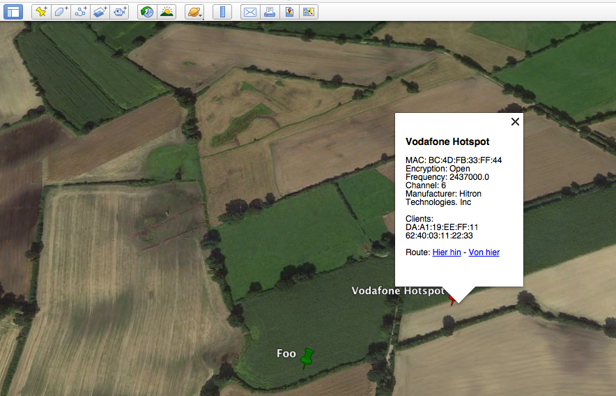

This library can be used to analyze the results of the new Kismet version. To filter encryption types [Kismet](https://github.com/kismetwireless/kismet) version "f07735c" (Aug 19, 2018) or later is required.


The following scripts will be installed:

1. **kismet_analyzer_aplist:** This script can be used to extract access points from the SQLite database *<db>.kismet* and export these results to *csv* and *kml*
2. **kismet_analyzer_clientlist** This script can be used to create a list of connected clients for a given SSID. The list is printed to stdout with one client mac per row.

## License

This script is licensed under the GNU General Public License in version 3. See http://www.gnu.org/licenses/ for further details.


## Installation:

### Installation via pip
```
pip install kismet-analyzer
```

### Manual installation from this repository 
This library requires *simplekml* for exporting extracted information to *kml*. You can use *pip* to install the neccessary requirement.
```
pip install -r requirements.txt
```

The setup script can be used to install the library and requirements. It will create the above listed console commands.
```
python setup.py install
```

## Usage:

```
(venv)[kismet-analyzer]$ kismet_analyzer_aplist -h
usage: kismet_analyzer_aplist [-h] --in INFILE [--out OUTFILE] [--title TITLE]
                              [--ssid SSID] [--exclude-ssid EXCLUDESSID]
                              [--strongest-point] [--encryption ENCRYPTION]
                              [--csv] [--kml] [--verbose]

Kismet to KML Log Converter

optional arguments:
  -h, --help            Show this help message and exit
  --in INFILE           Input file (.kismet) 
  --out OUTFILE         Output filename (optional)
  --title TITLE         Title embedded in KML file
  --ssid SSID           Only plot networks which match the SSID (or SSID
                        regex)
  --exclude-ssid EXCLUDESSID
                        Exclude networks which match the SSID (or SSID
                        regex)
  --strongest-point     Plot points based on strongest signal
  --encryption ENCRYPTION
                        Show only networks with given encryption type
  --csv                 Export results to csv
  --kml                 Export results to kml
  --verbose             Print MAC, SSID, encryption type to stdout

```

Export only access points with encryption type "Open" to csv and kml files:
```
kismet_analyzer_aplist --in input.kismet --out test --encryption "Open" --kml --csv 
Exported 11 devices to test.csv
Exported 11 devices to test.kml
```
## Output example for kml exports

The script generates colored notes for exported access points. The color depends on the identified encryption type. WPA encrypted access points will be added with a green color, WEP encrypted networks will be displayed in orange and Open network are displayed in red. Networks were the encryption type could not be detected will be added as a yellow note. Each note contains detailed meta information about the access point (SSID, MAC address, frequency, channel, manufacturer, and a list of clients MAC addresses).

